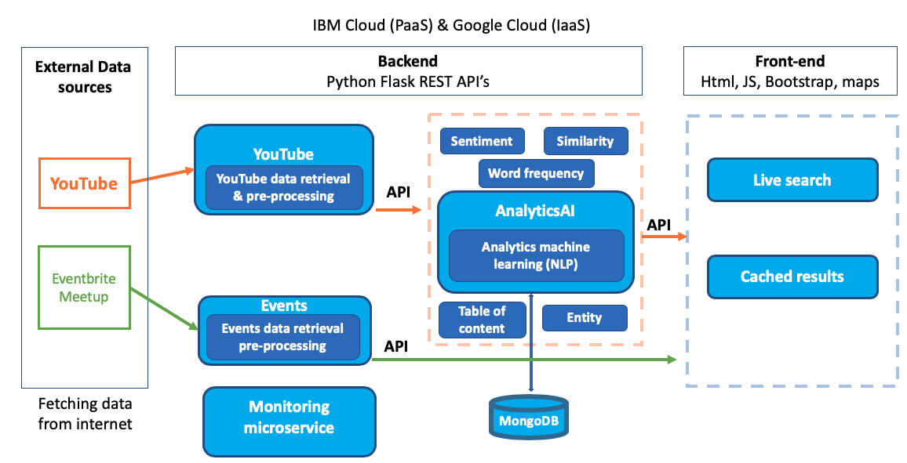

# Abracadata YouSights project

URL: https://yousight.eu-gb.mybluemix.net/

Our website supports Chrome and Firefox (desktop version). Please use Chrome or Firefox (desktop version) to test our website.

Here is a demo video for our website: https://vimeo.com/354742556

The main goal of YouSights is to provide a system where users can quickly identify and select the most useful videos for their educational needs on topics related to computer science. This is achieved by providing the user with refined video search results focused on educational videos and providing interesting visualisations based on the actual content of the video. The YouTube REST API is used to extract video transcripts both in real-time and in the background. YouSights has a comprehensive natural language processing pipeline to analyse tutorial video transcripts and extract key content automatically. The application also extracts key entities discussed in the video and filters comments based on their sentiment. Additionally, YouSights provides an aggregation service for technical events related to the user's search queries. 

Currently, the application is integrated with MeetUp and EventBrite via the RESTful APIs exposed by these companies. The application is written in Python with Flask used as the web framework, and MongoDB used for data storage. The front end has been written in JavaScript, relying on the JQuery library to provide an intuitive and stylish user interface for users to interact with. YouSights is currently hosted in a Multi-Cloud environment (GCP and IBM Cloud) with state-of-the-art CI-CD using Travis. Initial evaluation experiments proved promising for the application's main features and showed good user satisfaction with the application.

AbracaData team :)